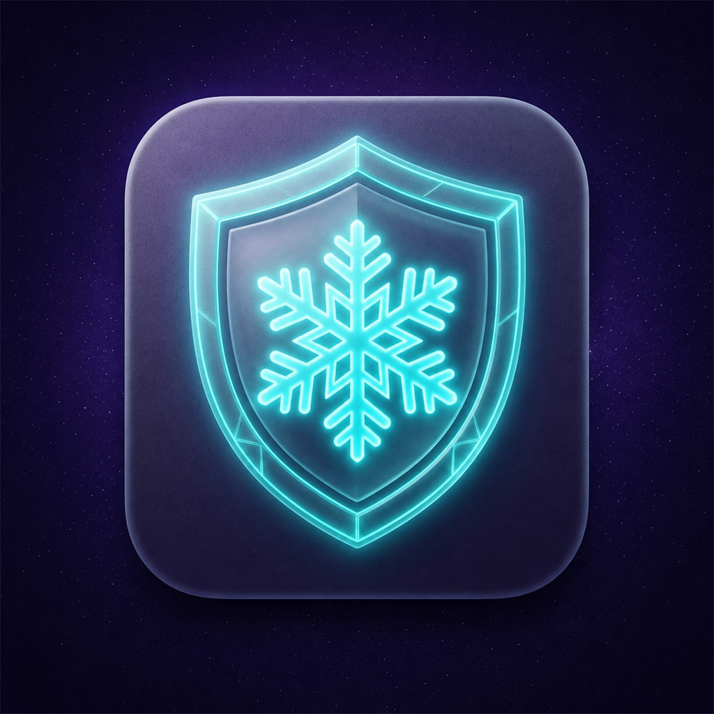

<p align="center">
  
</p>

<h1 align="center">ЗимаVPN</h1>

<p align="center">
  Android-клиент на базе Xray с умным выбором приоритетных маршрутов,
  быстрым переключением Wi‑Fi/LTE и встроенным обновлением GeoIP/Geosite.
</p>

<p align="center">
  <a href="https://github.com/VerentiX/WinterVPN/releases"></a>
  
  
  <a href="LICENSE"></a>
</p>

> [!IMPORTANT]
> ЗимаVPN — это клиентское приложение. Оно не предоставляет VPN-сервер,
> подписку или доступ к сторонним сетям. Для подключения необходим собственный
> сервер либо совместимая конфигурация Xray.

## Возможности

- Подключение через Xray Core и стандартный Android `VpnService`.
- Импорт обычных профилей, подписок и пользовательских JSON-конфигураций.
- Умный приоритетный failover для маршрутов `P0`, `P5`, `P10` и других уровней.
- Несколько серверов с одинаковым приоритетом, например несколько `P0`.
- Закрепление выбранного маршрута без постоянных переключений из-за колебаний пинга.
- Параллельная проверка резервных маршрутов после отказа активного подключения.
- Сохранение выбранного маршрута при переходе между Wi‑Fi и мобильной сетью.
- Жёсткое пересоздание TUN при реальной смене сети для сброса зависших TCP/UDP-сессий.
- Энергосберегающая частота проверок при выключенном экране.
- Обновление `geoip.dat` и `geosite.dat` непосредственно из приложения.
- Отображение фактически используемого приоритетного маршрута.
- Проверка обновлений приложения через GitHub Releases.

## Как работает выбор маршрута

Приоритет определяется числом в теге маршрута: чем меньше число, тем выше
приоритет. Например, `P0` предпочтительнее `P5`, а `P5` предпочтительнее `P10`.

```text
Доступен P0? ── да ──> выбрать самый быстрый доступный P0
      │
      нет
      ↓
Доступен P5? ── да ──> выбрать самый быстрый доступный P5
      │
      нет
      ↓
Проверить P10, P15 и следующие уровни
```

Основные правила:

1. При первом полном запуске маршруты проверяются параллельно.
2. Сначала выбирается лучший доступный приоритет.
3. Минимальная задержка учитывается только между маршрутами одного приоритета.
4. После выбора приложение остаётся на текущем маршруте.
5. Если активный маршрут перестал отвечать, остальные варианты проверяются параллельно.
6. При восстановлении более приоритетного уровня приложение может вернуться на него.

По умолчанию активный маршрут проверяется каждые 5 секунд при включённом экране
и раз в 60 секунд при выключенном. Адрес проверки берётся из поля
`burstObservatory.pingConfig.destination` пользовательского JSON. Если корректный
адрес отсутствует, используется URL проверки из настроек приложения.

Пример соответствующей части конфигурации:

```json
{
  "burstObservatory": {
    "subjectSelector": ["route-"],
    "pingConfig": {
      "destination": "https://example.com/generate_204",
      "httpMethod": "GET",
      "timeout": "3s"
    }
  }
}
```

Маршруты одного уровня должны иметь одинаковый номер приоритета, например
`route-p0000-primary` и `route-p0000-secondary` для группы `P0`.

## Переключение Wi‑Fi и LTE

При реальной смене основной сети приложение:

1. Запоминает текущий выбранный маршрут.
2. Привязывает исходящие соединения к новой Android-сети.
3. Пересоздаёт TUN и перезапускает транспорт, чтобы закрыть старые сессии.
4. Запускает Xray с тем же активным маршрутом.

Повторные системные события одной и той же сети объединяются и не вызывают
лишних перезапусков. После ручной остановки VPN или нового полного запуска
начальный выбор по приоритету и задержке выполняется заново.

## Установка

Текущая версия исходников: **1.1.3**.

Готовые APK публикуются в разделе
[GitHub Releases](https://github.com/VerentiX/WinterVPN/releases).

Для большинства современных устройств подходит вариант `arm64-v8a`.
Универсальный APK содержит библиотеки для всех поддерживаемых архитектур и
занимает больше места.

> [!NOTE]
> Для обновления поверх уже установленной версии APK должен быть подписан тем же
> ключом. Сборка с другим ключом устанавливается только после удаления предыдущей версии.

## Сборка из исходников

### Требования

- Android Studio с поддержкой текущей версии Android Gradle Plugin.
- JDK 17 или новее.
- Android SDK для `compileSdk 37`.
- Git.

Репозиторий является монорепозиторием: необходимые исходники Xray-обвязки,
`hev-socks5-tunnel` и готовые Android-библиотеки уже находятся внутри него.
Загрузка submodule не требуется.

### Android Studio

1. Клонируйте репозиторий:

   ```bash
   git clone https://github.com/VerentiX/WinterVPN.git
   ```

2. Откройте каталог `WinterVPN/V2rayNG` в Android Studio.
3. Дождитесь завершения Gradle Sync.
4. Выберите вариант `fdroidDebug` или `fdroidRelease`.
5. Запустите сборку через **Build → Build APK(s)**.

### Командная строка

Windows:

```powershell
cd V2rayNG
.\gradlew.bat :app:assembleFdroidDebug
```

Linux/macOS:

```bash
cd V2rayNG
./gradlew :app:assembleFdroidDebug
```

Запуск модульных тестов:

```powershell
.\gradlew.bat :app:testFdroidDebugUnitTest
```

## Структура репозитория

```text
WinterVPN/
├── AndroidLibXrayLite/   # Android-обвязка Xray Core
├── hev-socks5-tunnel/    # исходники TUN ↔ SOCKS транспорта
└── V2rayNG/              # Android-приложение ЗимаVPN
    ├── app/
    ├── branding/
    └── gradle/
```

Все каталоги входят в один Git-репозиторий. Вложенных Git-репозиториев и
submodule нет.

## GeoIP и Geosite

Базовые `geoip.dat` и `geosite.dat` включены в приложение. После установки
рабочие копии находятся в каталоге приложения, обычно:

```text
Android/data/com.v2ray.ang.fdroid/files/assets
```

Точный путь может отличаться в зависимости от варианта сборки и версии Android.
Файлы можно обновлять средствами приложения или заменять совместимыми версиями.

## Происхождение проекта

ЗимаVPN основан на открытом проекте
[2dust/v2rayNG](https://github.com/2dust/v2rayNG) и использует компоненты
[Xray Core](https://github.com/XTLS/Xray-core) и
[hev-socks5-tunnel](https://github.com/heiher/hev-socks5-tunnel).

Спасибо авторам и участникам этих проектов. Изменения ЗимаVPN, включая логику
приоритетных маршрутов и обработку смены сети, поддерживаются в этом репозитории.

## Лицензия

Проект распространяется на условиях
[GNU General Public License v3.0](LICENSE). Лицензии сторонних компонентов
сохранены в соответствующих каталогах.
